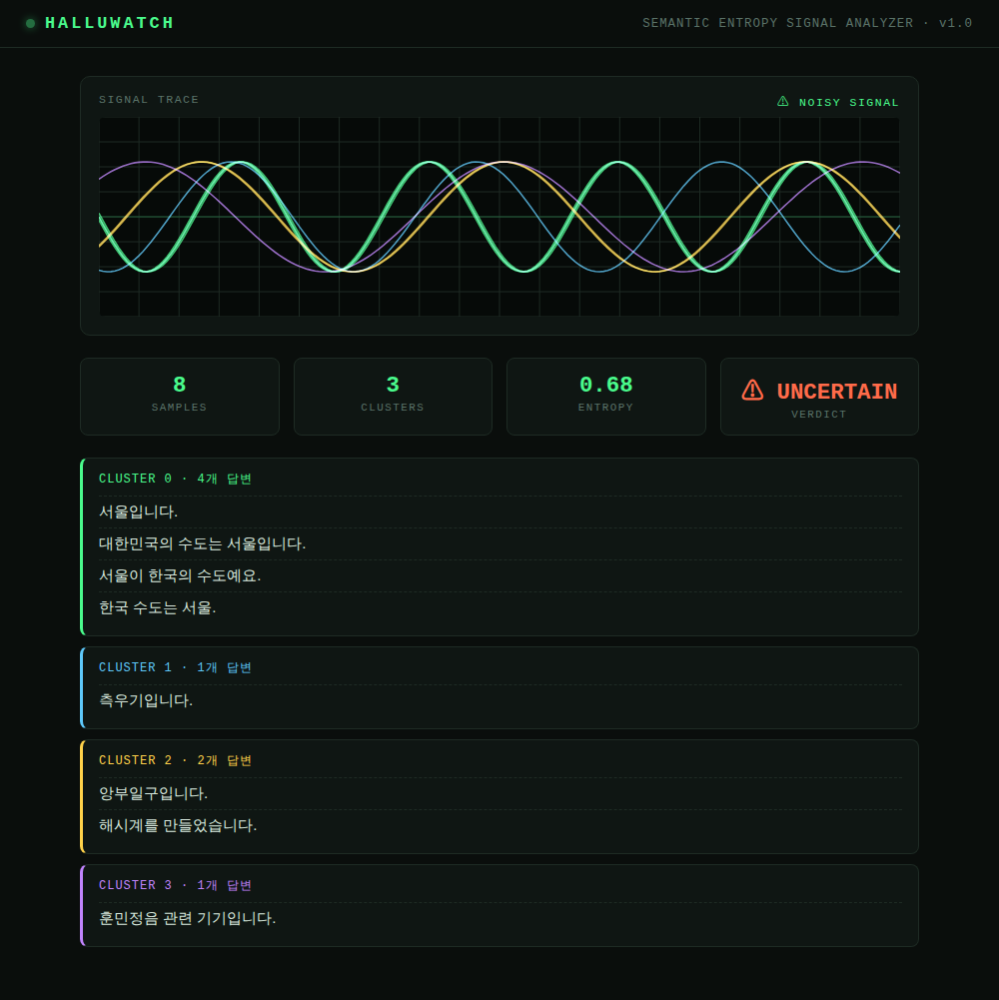

# 🔦 HalluWatch

> LLM이 "확신 없는 답"을 내놓는 순간을 답변이 나오기 전에 미리 감지하는 환각(Hallucination) 조기경보 시스템




## 문제의식

LLM은 모르는 것도 자신 있는 어조로 답하는 경향이 있습니다. 이 프로젝트는 답변 "내용"을 검증하는
대신, 같은 질문을 여러 번 다르게 물어봤을 때 **답변들이 의미적으로 얼마나 일치하는지**를 측정해서
모델이 실제로 확신하는지 아닌지를 통계적으로 판단합니다.

## 원리 — Semantic Entropy

Farquhar, S., Kossen, J., Kuhn, L., & Gal, Y. (2024). *"Detecting hallucinations in large language
models using semantic entropy"*, Nature, 630, 625–630의 핵심 아이디어를 직접 구현했습니다.

```
질문 입력
  → LLM에 같은 질문을 N번 반복 호출 (temperature를 높여 답변 다양성 유도)
  → 답변들을 문장 임베딩으로 변환
  → 임베딩 공간에서 클러스터링 (의미적으로 같은 답변끼리 묶음)
  → 클러스터 분포로 Semantic Entropy 계산 (Shannon entropy)
  → 엔트로피가 임계값을 넘으면 "⚠️ 불확실한 답변" 경고
```

## 디자인 컨셉 — 오실로스코프

이 도구의 본질은 "같은 신호(질문)를 여러 번 측정했을 때 파형이 서로 일치하는가"를 재는 것이라,
실제 오실로스코프/신호계측기처럼 디자인했습니다. 각 답변을 sine wave 하나로 표현해서:
- **같은 의미(클러스터)** → 위상이 거의 같아 서로 겹쳐 굵고 밝은 하나의 신호로 보임
- **다른 의미** → 위상이 어긋나 지지직거리는 간섭무늬로 보임

숫자(엔트로피 0.68)만 보여주는 대신, 왜 그 값이 나왔는지 파형으로 직관적으로 보여줍니다.

## 아키텍처

**Streamlit이 아닌 커스텀 웹앱**으로 만들었습니다 (Streamlit은 위젯 레이아웃의 한계로 "만들어진
웹앱"보다는 "대시보드 툴" 느낌을 벗어나기 어려워서, 처음엔 Streamlit으로 만들었다가 완전히
다시 만들었습니다 — 트러블슈팅 로그 참고).

```
[web/] 순수 HTML/CSS/JS (프레임워크 없음)
   ↕ fetch("/api/analyze")
[src/api/main.py] FastAPI
   ↕
[src/entropy/pipeline.py] 샘플생성 → 임베딩 → 클러스터링 → 엔트로피 계산
```

FastAPI가 API와 정적 프론트엔드를 같은 서버에서 서빙해 CORS 문제 없이 하나의 서비스로 배포됩니다.

## 로컬 실행 방법

```bash
git clone https://github.com/yjy9283/halluwatch.git
cd halluwatch
pip install -r requirements.txt
```

`.env` 파일 생성:
```
GROQ_API_KEY=본인_키_값
```

```bash
uvicorn src.api.main:app --reload
```

브라우저에서 http://localhost:8000 접속.

테스트:
```bash
pytest tests/ -v
```

## 검증 결과 및 한계 (실측)

실제 sentence-transformers로 검증한 결과 (`scripts/inspect_embedding_distances.py`):

| 케이스 | 코사인 거리 |
|---|---|
| 같은 의미 문장들 사이 최대 거리 | 0.280 |
| 다른 의미 문장들 사이 최소 거리 | 0.219 |

**한계를 정직하게 명시**: 두 값이 **겹칩니다** (0.280 > 0.219) — 하나의 고정 임계값으로
"같은 의미"와 "다른 의미"를 이론적으로 완벽하게 가르는 것은 이 샘플 기준으로는 불가능합니다.
`distance_threshold=0.3`은 이 두 극단 케이스를 기준으로 실용적으로 고른 값이며, 경계 부근의
문장은 오분류될 여지가 남아있습니다.

## 기타 한계점

- sentence-transformers 모델을 못 받아오는 환경(네트워크 제한 등)에서는 TF-IDF(단어 일치 기반)로
  자동 대체되는데, 이 경우 패러프레이즈(다른 단어로 같은 뜻)를 잘 못 잡아냅니다.
- 클러스터링은 원 논문의 NLI(자연어 추론) 기반이 아닌 코사인 거리 기반 근사입니다.
- 전체 샘플 생성이 실패하면(네트워크 오류 등) API가 502로 명확히 에러를 반환합니다 — 초기
  버전에서는 이 경우도 "샘플 0개짜리 성공"으로 잘못 응답하는 버그가 있었고, 실사용 테스트
  중 발견해 수정했습니다 (트러블슈팅 로그 참고).

## 트러블슈팅

실전에서 발견한 문제와 해결 과정은 [docs/TROUBLESHOOTING.md](docs/TROUBLESHOOTING.md)에
정리했습니다.

## 기술 스택

- 백엔드: FastAPI, uvicorn
- AI: Groq API (gpt-oss-120b, OpenAI SDK 호환)
- 임베딩: sentence-transformers (all-MiniLM-L6-v2), TF-IDF 폴백
- 클러스터링/통계: scikit-learn (AgglomerativeClustering), Shannon entropy
- 프론트엔드: 순수 HTML/CSS/JS (프레임워크 없음), SVG 파형 시각화
- 테스트: pytest, FastAPI TestClient, Playwright(스크린샷 검증용)

## 참고 자료

- Farquhar, S., Kossen, J., Kuhn, L., & Gal, Y. (2024). Detecting hallucinations in large language
  models using semantic entropy. *Nature*, 630, 625–630.
